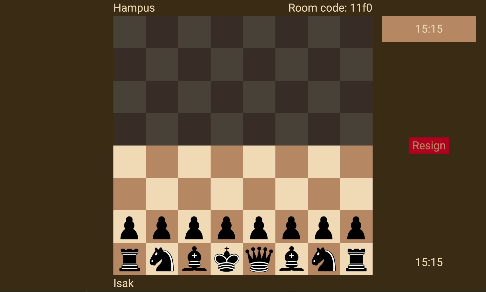

# Fog of War


## Description
An online chess game in the Fog-of-war variant. You can only see squares which you can move to and/or attack with your own pieces.

Players can create and join online game lobbies.
Game server repo (made in TypeScript): https://gits-15.sys.kth.se/hallkvi/fog_of_war_server

## Installation
* Make sure you have rust installed on your system
* In the repository folder open up a terminal and write:
```
cargo run --release
```
Alternativly you may download the program directly from the [release page](https://gits-15.sys.kth.se/ieinberg/Fog-of-War-Chess/releases).

## Collaborators
* Isak Einberg
* Hampus Hallkvist

## Dependencies:
* ggez: Game and graphics library.
* rust_socketio: Socket.io implementation for Rust.
* serde_json: JSON parsing.
* state: State manager.

Upplägg:

* Första veckan:
  * ~Implementera pjäser och bräde~
  * ~Designa brädet och pjäser (grafikdelen)~
  * ~Kunna dra och släppa pjäser~
  * ~Piece logic & Move validation~
  * ~Nätverk (server NodeJS)~

* Andra veckan:
  * ~Player implementation~
    * ~Turn-system: Spelare kan endast flytta sina egna pjäser på sin egen turn.~
    * ~Win/lose system~
  * ~Main menu implementation~
  * ~Special rules (rockad/castling, promotion, en passant)~

* Tredje veckan/Om tid finns:
  * ~Fog of war-system (Isak)~
    * ~(Pjäser kan “se” de rutor som de kan attackera och/eller gå till)~
  * ~Movement indication (Isak)~
  * ~Select by clicking (Isak)~
  * ~Ljudsystem (Hampus)~
  * ~Vinst/förlust (att nått händer) (Hampus)~
  * ~Dekorera main menu (Hampus)~
  * ~Schackklocka (Hampus)~
  * ~Pre-moves (Isak)~
  * Joina lobby som åskådare (Hampus)
  * ~Ange namn när man skapar/joinar en lobby. (Hampus)~
  * See captured pieces (Hampus)
  * ~Resign-knapp (Hampus)~
  * Navigera genom historik av drag (Isak)
  * Ändra färg på brädet
